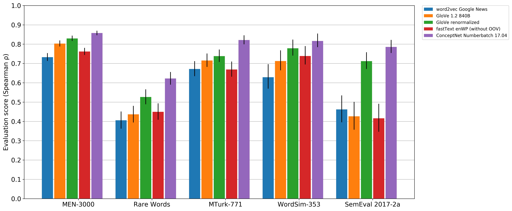
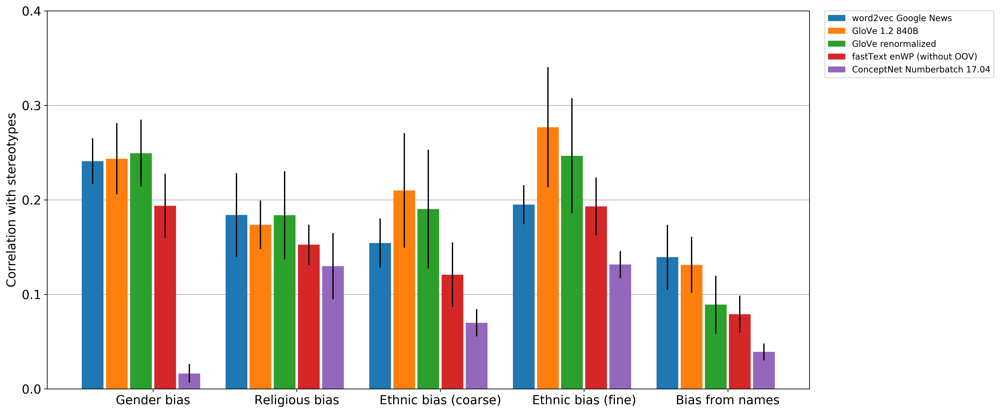

## The best pre-computed word embeddings you can use

ConceptNet Numberbatch is a set of semantic vectors (also known as word embeddings)
than can be used directly as a representation of word meanings or as a starting point
for further machine learning.

ConceptNet Numberbatch is part of the [ConceptNet](http://conceptnet.io) open
data project. ConceptNet is a knowledge graph that provides lots of ways to
compute with word meanings, one of which is word embeddings, while ConceptNet
Numberbatch is a snapshot of just the word embeddings.

These embeddings benefit from the fact that they have semi-structured, common
sense knowledge from ConceptNet, giving them a way to learn about words that
isn't _just_ observing them in context.

Numberbatch is built using an ensemble that combines data from ConceptNet, word2vec,
GloVe, and OpenSubtitles 2016, using a variation on retrofitting. It is
described in the paper [ConceptNet 5.5: An Open Multilingual Graph of General
Knowledge][cn55-paper], presented at AAAI 2017.

Unlike most embeddings, ConceptNet Numberbatch is **multilingual** from the
ground up.  Words in different languages share a common semantic space, and
that semantic space is informed by all of the languages.

### Evaluation and publications

ConceptNet Numberbatch can be seen as a replacement for other precomputed
embeddings, such as word2vec and GloVe, that do not include the graph-style
knowledge in ConceptNet. Numberbatch outperforms these datasets on benchmarks
of word similarity.

ConceptNet Numberbatch took first place in both subtasks at SemEval 2017 task
2, "[Multilingual and Cross-lingual Semantic Word Similarity][semeval17-2]".
Within that task, it was also the first-place system in each of English,
German, Italian, and Spanish. The result is described in our ACL 2017 SemEval
paper, "[Extending Word Embeddings with Multilingual Relational Knowledge][semeval-paper]".

[cn55-paper]: https://arxiv.org/abs/1612.03975
[semeval17-2]: http://alt.qcri.org/semeval2017/task2/
[semeval-paper]: https://arxiv.org/abs/1704.03560

The code and papers were created as a research project of [Luminoso
Technologies, Inc.][luminoso], by Robyn Speer, Joshua Chin, Catherine Havasi, and
Joanna Lowry-Duda.

### Now with more fairness

Word embeddings are prone to learn human-like stereotypes and prejudices.
ConceptNet Numberbatch 17.04 and later counteract this as part of the build
process, leading to word vectors that are less prejudiced than competitors such
as word2vec and GloVe. See [our blog post on reducing
bias](https://blog.conceptnet.io/2017/04/24/conceptnet-numberbatch-17-04-better-less-stereotyped-word-vectors/).

A paper by Chris Sweeney and Maryam Najafian, ["A Transparent Framework for
Evaluating Unintended Demographic Bias in Word Embeddings"][sweeney-paper],
independently evaluates bias in precomputed word embeddings, and finds that
ConceptNet Numberbatch is less likely than GloVe to inherently lead to
demographic discrimination.

[sweeney-paper]: (https://www.aclweb.org/anthology/P19-1162)

## Code

Since 2016, the code for building ConceptNet Numberbatch is part of the [ConceptNet
code base][conceptnet5], in the `conceptnet5.vectors` package.

The only code contained in _this_ repository is `text_to_uri.py`, which
normalizes natural-language text into the ConceptNet URI representation,
allowing you to look up rows in these tables without requiring the entire
ConceptNet codebase. For all other purposes, please refer to the [ConceptNet
code][conceptnet5].

[conceptnet5]: https://github.com/commonsense/conceptnet5

## Out-of-vocabulary strategy

ConceptNet Numberbatch is evaluated with an out-of-vocabulary strategy that
helps its performance in the presence of unfamiliar words. The strategy is
implemented in the [ConceptNet code base][conceptnet5]. It can be summarized
as follows:

- Given an unknown word whose language is not English, try looking up the
  equivalently-spelled word in the English embeddings (because English words
  tend to end up in text of all languages).
- Given an unknown word, remove a letter from the end, and see if that is
  a prefix of known words. If so, average the embeddings of those known words.
- If the prefix is still unknown, continue removing letters from the end until
  a known prefix is found. Give up when a single character remains.

## Downloads

[ConceptNet Numberbatch 19.08][nb1908-main] is the current recommended download.

This table lists the downloads and formats available for multiple recent versions:

| Version  | Multilingual                            | English-only                              | HDF5                         |
| -------- | --------------------------------------- | ----------------------------------------- | ---------------------------- |
| **19.08**| [numberbatch-19.08.txt.gz][nb1908-main] | [numberbatch-en-19.08.txt.gz][nb1908-en]  |                              |
| 17.06    | [numberbatch-17.06.txt.gz][nb1706-main] | [numberbatch-en-17.06.txt.gz][nb1706-en]  | [17.06/mini.h5][nb1706-mini] |
| 17.04    | [numberbatch-17.04.txt.gz][nb1704-main] | [numberbatch-en-17.04b.txt.gz][nb1704-en] | [17.05/mini.h5][nb1704-mini] |
| 17.02    | [numberbatch-17.02.txt.gz][nb1704-main] | [numberbatch-en-17.02.txt.gz][nb1702-en]  |                              |
| 16.09    |                                         |                                           | [16.09/numberbatch.h5][nb1609-h5] |

The 16.09 version was the version published at AAAI 2017. You can reproduce its results using a Docker snapshot of the conceptnet5 repository.
See the instructions on the [ConceptNet wiki](https://github.com/commonsense/conceptnet5/wiki/Running-your-own-copy#reproducing-the-word-embedding-evaluation).

[nb1908-main]: https://conceptnet.s3.amazonaws.com/downloads/2019/numberbatch/numberbatch-19.08.txt.gz
[nb1908-en]: https://conceptnet.s3.amazonaws.com/downloads/2019/numberbatch/numberbatch-en-19.08.txt.gz

[nb1706-main]: https://conceptnet.s3.amazonaws.com/downloads/2017/numberbatch/numberbatch-17.06.txt.gz
[nb1706-en]: https://conceptnet.s3.amazonaws.com/downloads/2017/numberbatch/numberbatch-en-17.06.txt.gz
[nb1706-mini]: http://conceptnet.s3.amazonaws.com/precomputed-data/2016/numberbatch/17.06/mini.h5

[nb1704-main]: https://conceptnet.s3.amazonaws.com/downloads/2017/numberbatch/numberbatch-17.04.txt.gz
[nb1704-en]: https://conceptnet.s3.amazonaws.com/downloads/2017/numberbatch/numberbatch-en-17.04b.txt.gz
[nb1704-mini]: http://conceptnet.s3.amazonaws.com/precomputed-data/2016/numberbatch/17.05/mini.h5

[nb1702-main]: http://conceptnet.s3.amazonaws.com/downloads/2017/numberbatch/numberbatch-17.02.txt.gz
[nb1702-en]: http://conceptnet.s3.amazonaws.com/downloads/2017/numberbatch/numberbatch-en-17.02.txt.gz

[nb1609-h5]: http://conceptnet.s3.amazonaws.com/precomputed-data/2016/numberbatch/16.09/numberbatch.h5

The .txt.gz files of term vectors are in the text format used by word2vec, GloVe, and fastText.

The first line of the file contains the dimensions of the matrix:

    9161912 300

Each line contains a term label followed by 300 floating-point numbers,
separated by spaces:

    /c/en/absolute_value -0.0847 -0.1316 -0.0800 -0.0708 -0.2514 -0.1687 -...
    /c/en/absolute_zero 0.0056 -0.0051 0.0332 -0.1525 -0.0955 -0.0902 0.07...
    /c/en/absoluteless 0.2740 0.0718 0.1548 0.1118 -0.1669 -0.0216 -0.0508...
    /c/en/absolutely 0.0065 -0.1813 0.0335 0.0991 -0.1123 0.0060 -0.0009 0...
    /c/en/absolutely_convergent 0.3752 0.1087 -0.1299 -0.0796 -0.2753 -0.1...

The HDF5 files are the format that ConceptNet uses internally. They are data
tables that can be loaded into Python using a library such as `pandas` or
`pytables`.

The "mini.h5" files trade off a little bit of accuracy for a lot of
memory savings, taking up less than 150 MB in RAM, and are used to power the
[ConceptNet API](https://github.com/commonsense/conceptnet5/wiki/API).

## License and attribution

These vectors are distributed under the [CC-By-SA 4.0][cc-by-sa] license. In
short, if you distribute a transformed or modified version of these vectors,
you must release them under a compatible Share-Alike license and give due
credit to [Luminoso][luminoso].

Some suggested text:

    This data contains semantic vectors from ConceptNet Numberbatch, by
    Luminoso Technologies, Inc. You may redistribute or modify the
    data under the terms of the CC-By-SA 4.0 license.

[cc-by-sa]: https://creativecommons.org/licenses/by-sa/4.0/
[luminoso]: http://luminoso.com

If you build on this data, you should cite it. Here is a straightforward citation:

> Robyn Speer, Joshua Chin, and Catherine Havasi (2017). "ConceptNet 5.5: An Open Multilingual Graph of General Knowledge." In proceedings of AAAI 2017.

In BibTeX form, the citation is:

    @inproceedings{speer2017conceptnet,
        title = {{ConceptNet} 5.5: An Open Multilingual Graph of General Knowledge},
        url = {http://aaai.org/ocs/index.php/AAAI/AAAI17/paper/view/14972},
        author = {Speer, Robyn and Chin, Joshua and Havasi, Catherine},
        year = {2017},
        pages = {4444--4451}
    }

This data is itself built on:

  - [ConceptNet 5.7][conceptnet], which contains data from Wiktionary,
    WordNet, and many contributors to Open Mind Common Sense projects,
    edited by Robyn Speer

  - [GloVe][glove], by Jeffrey Pennington, Richard Socher, and Christopher
    Manning

  - [word2vec][], by Tomas Mikolov and Google Research

  - Parallel text from [OpenSubtitles 2016][opensubtitles], by Pierre Lison
    and Jörg Tiedemann, analyzed using [fastText][], by Piotr Bojanowski,
    Edouard Grave, Armand Joulin, and Tomas Mikolov

[conceptnet]: http://conceptnet.io/
[glove]: http://nlp.stanford.edu/projects/glove/
[word2vec]: https://code.google.com/archive/p/word2vec/
[opensubtitles]: http://opus.lingfil.uu.se/OpenSubtitles2016.php
[fastText]: https://github.com/facebookresearch/fastText

## Language statistics

The multilingual data in ConceptNet Numberbatch represents 78 different language
codes, though some have vocabularies with much more coverage than others. The following
table lists the languages and their vocabulary size.

You may notice a focus on even the smaller and historical languages of Europe,
and under-representation of widely-spoken languages from outside Europe, which
is an effect of the availability of linguistic resources for these languages.
We would like to change this, but it requires finding good source data for
ConceptNet in these under-represented languages.

Because Numberbatch contains word forms, inflected languages end up with larger
vocabularies.

These vocabulary sizes were updated for ConceptNet Numberbatch 19.08.

| code | language                       | vocab size |
|:-----|:-------------------------------|-----------:|
|   fr | French                         |    1388686 |
|   la | Latin                          |     855294 |
|   es | Spanish                        |     651859 |
|   de | German                         |     594456 |
|   it | Italian                        |     557743 |
|   en | English                        |     516782 |
|   ru | Russian                        |     455325 |
|   zh | Chinese                        |     307441 |
|   fi | Finnish                        |     267307 |
|   pt | Portuguese                     |     262904 |
|   ja | Japanese                       |     256648 |
|   nl | Dutch                          |     190221 |
|   bg | Bulgarian                      |     178508 |
|   sv | Swedish                        |     167321 |
|   pl | Polish                         |     152949 |
|   no | Norwegian Bokmål               |     105689 |
|   eo | Esperanto                      |      96255 |
|   th | Thai                           |      95342 |
|   sl | Slovenian                      |      91134 |
|   ms | Malay                          |      90554 |
|   cs | Czech                          |      88613 |
|   ca | Catalan                        |      87508 |
|   ar | Arabic                         |      85325 |
|   hu | Hungarian                      |      74384 |
|   se | Northern Sami                  |      67601 |
|   sh | Serbian                        |      66746 |
|   el | Greek                          |      65905 |
|   gl | Galician                       |      59006 |
|   da | Danish                         |      57119 |
|   fa | Persian                        |      53984 |
|   ro | Romanian                       |      51437 |
|   tr | Turkish                        |      51308 |
|   is | Icelandic                      |      48639 |
|   eu | Basque                         |      44151 |
|   ko | Korean                         |      42106 |
|   vi | Vietnamese                     |      39802 |
|   ga | Irish                          |      36988 |
|  grc | Ancient Greek                  |      36977 |
|   uk | Ukrainian                      |      36851 |
|   lv | Latvian                        |      36333 |
|   he | Hebrew                         |      33435 |
|   mk | Macedonian                     |      33370 |
|   ka | Georgian                       |      32338 |
|   hy | Armenian                       |      29844 |
|   sk | Slovak                         |      29376 |
|   lt | Lithuanian                     |      28826 |
|  ast | Asturian                       |      28401 |
|   mg | Malagasy                       |      26865 |
|   et | Estonian                       |      26525 |
|   oc | Occitan                        |      26095 |
|  fil | Filipino                       |      25088 |
|   io | Ido                            |      25004 |
|  hsb | Upper Sorbian                  |      24852 |
|   hi | Hindi                          |      23538 |
|   te | Telugu                         |      22173 |
|   be | Belarusian                     |      22117 |
|  fro | Old French                     |      21249 |
|   sq | Albanian                       |      20493 |
|  mul | (Multilingual, such as emoji)  |      19376 |
|   cy | Welsh                          |      18721 |
|  xcl | Classical Armenian             |      18420 |
|   az | Azerbaijani                    |      17184 |
|   kk | Kazakh                         |      16979 |
|   gd | Scottish Gaelic                |      16827 |
|   af | Afrikaans                      |      16132 |
|   fo | Faroese                        |      15973 |
|  ang | Old English                    |      15700 |
|   ku | Kurdish                        |      13804 |
|   vo | Volapük                        |      12731 |
|   ta | Tamil                          |      12690 |
|   ur | Urdu                           |      12006 |
|   sw | Swahili                        |      11150 |
|   sa | Sanskrit                       |      11081 |
|  nrf | Norman French                  |      10048 |
|  non | Old Norse                      |       8536 |
|   gv | Manx                           |       8425 |
|   nv | Navajo                         |       8232 |
|  rup | Aromanian                      |       5107 |

## Referred here from an old version?

An unpublished paper of ours described the "ConceptNet Vector Ensemble", and refers to
a repository that now redirects here, and an attached store of data that is no
longer hosted. We apologize, but we're not supporting the unpublished paper.
Please use a newer version and use the currently supported
[ConceptNet build process](https://github.com/commonsense/conceptnet5/wiki/Build-process).

## Image credit

The otter logo was designed by [Christy
Presler](https://thenounproject.com/cnpresler/) for The Noun Project, and is
used under a Creative Commons Attribution license.
